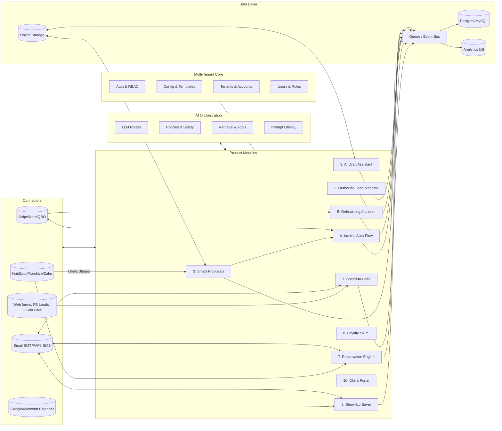

# SMB Automation – Modular SaaS Blueprint
_Last updated: 2025-09-25 01:47 (AEST)_

This document specifies a modular, multi-tenant SaaS for small–medium businesses (SMBs) that delivers **boring-but-profitable** automation around the five money stages: **Leads → Sales → Onboarding → Fulfillment → Reactivation**. Each module is a small, independently deployable unit that can be installed alone or stacked into packages per niche.

> Build rule-of-thumb: **2–6 steps per flow**, bias to the simplest path that **touches money** first.

---

## 0) High-Level Goals
- **Immediate ROI**: speed-to-lead, show-up rate, invoice speed, reactivation.
- **Modular**: each module solves one outcome; combine as packages by niche.
- **Multi-tenant**: easy onboarding, zero-code config, role-based access.
- **Interop-first**: integrate with CRMs, calendars, email, SMS, payments.
- **AI where it helps**: draft/reply/route/decide; human remains in control.

---

## 1) System Architecture (Blueprint)

**Notes**
- **Event-driven**: every module emits/consumes events via **Q (Queue/Event Bus)** (e.g., NATS, RabbitMQ, Kafka, or lightweight Redis streams for v1).
- **Multi-tenant**: tenant_id on all records; config resolved per-tenant at runtime.
- **LLM Router**: chooses cheapest/fastest model that meets task quality; supports fallbacks.
- **Guardrails**: template-based prompts, PII scrubbing, output checks.

---

## 2) Cross-Cutting Foundations

### 2.1 Identity & Tenancy
- **Auth**: OAuth2/OIDC (Google/Microsoft), passwordless email, TOTP (optional).
- **RBAC**: Owner, Admin, Staff, Read-only, Client (for Portal).
- **Data isolation**: `tenant_id` on every table + row-level security where available.

### 2.2 Configuration
- **Per-tenant JSON config** with schema validation (pydantic/zod): channels, templates, SLAs, time windows, KPIs.
- **Template packs** by niche: Trades, Health, Beauty, Agency, Dental/Medical, Retail.

### 2.3 Messaging
- **Email**: provider-agnostic (SMTP/Resend/SES); per-tenant domains if available.
- **SMS**: Twilio/Vonage plug; rate-limits and quiet hours.
- **WhatsApp/DMs**: optional adapters (Meta APIs), feature-flagged.

### 2.4 Scheduling
- **Task runners**: Celery/RQ/Temporal. Cron-style for batch jobs; webhook-driven for real-time.
- **Windows**: Per-tenant quiet hours and retry policies.

### 2.5 Payments & Billing
- **SaaS billing**: Stripe subscriptions + metering (messages, contacts, seats).
- **Tenant payments**: Stripe/Xero/QBO connectors for clients’ invoices (module 4).

### 2.6 Observability
- **Tracing/Logs/Metrics**: OpenTelemetry, structured logs w/ tenant correlation.
- **Audit**: append-only audit events for admin actions and message delivery.

---

## 3) Modules (MVP Specs)

Each module follows the same spec: **Trigger → Inputs → Actions → Outputs → KPIs → Integrations → Edge Cases**.

### 3.1 Module: Speed‑to‑Lead (Inbound)
- **Trigger**: Web form / FB/IG lead / inbound email/DM.
- **Inputs**: Lead payload (name, contact, source, message), business hours.
- **Actions**: Validate → Create CRM contact → AI craft instant reply → send booking link → follow-up after 15 min if no booking → escalate if hot intent keywords.
- **Outputs**: Contact created, conversation thread, booking created or follow-up scheduled.
- **KPIs**: Time-to-first-response, booking rate, cost per booked call.
- **Integrations**: Forms API, CRM, Calendar, Email/SMS.
- **Edge**: Spam detection, duplicate leads, after-hours routing.

### 3.2 Module: Outbound Lead Machine
- **Trigger**: Campaign start (industry, geo, ICP).
- **Inputs**: Seed list or scraping source, daily send limit.
- **Actions**: Scrape/Clean → AI one-liners → throttle sends → handle replies → auto-tag interested.
- **Outputs**: New conversations, qualified leads list.
- **KPIs**: Reply rate, positive-reply rate, booked calls.
- **Integrations**: Email/SMS/DM API, CRM, enrichment APIs.
- **Edge**: Compliance (opt-out), bounce handling, warm-up domain strategy.

### 3.3 Module: Smart Proposals
- **Trigger**: CRM deal moved to “Proposal”.
- **Inputs**: Deal details, products/packages, pricing rules, proposal template.
- **Actions**: Generate proposal (PDF/HTML) → e-sign link → send → track opens → nudge if ignored → notify if opened 2x.
- **Outputs**: Proposal doc, status updates, signed artifact.
- **KPIs**: Time-to-proposal, open rate, close rate.
- **Integrations**: CRM, e-sign, Object storage, Email.
- **Edge**: Multi-versioning, legal clauses per niche.

### 3.4 Module: Invoice Auto‑Flow
- **Trigger**: Proposal accepted / job completed.
- **Inputs**: Accepted quote, tax rules, payment terms.
- **Actions**: Create invoice → send → payment reminders → reconcile status.
- **Outputs**: Invoice record, payment status.
- **KPIs**: Days Sales Outstanding (DSO), paid-in-7-days %.
- **Integrations**: Stripe/Xero/QBO, Email/SMS.
- **Edge**: Partial payments, surcharges, failed payments.

### 3.5 Module: Onboarding Autopilot
- **Trigger**: Payment received.
- **Inputs**: Client contact, onboarding template/checklist.
- **Actions**: Welcome email/video → kickoff scheduling → internal tasks → client portal access.
- **Outputs**: Onboarding checklist state, kickoff event.
- **KPIs**: Time-to-kickoff, checklist completion rate.
- **Integrations**: Calendar, Task engine, Portal, Email/SMS.
- **Edge**: Missing info capture, stalled checklists.

### 3.6 Module: Show‑Up Saver
- **Trigger**: Booking created.
- **Inputs**: Appointment details, channel preference.
- **Actions**: T‑minus reminders → confirmation prompt → auto-reschedule link if no confirm.
- **Outputs**: Confirmed/no-show status, rescheduled event.
- **KPIs**: No-show rate, confirmation rate.
- **Integrations**: Calendar, SMS/Email.
- **Edge**: Timezone/holiday handling, double-booking guard.

### 3.7 Module: Reactivation Engine
- **Trigger**: 60/90 days inactivity.
- **Inputs**: Past customer list, offers, win-back scripts.
- **Actions**: Personalized check-in → spaced follow-ups → handover to human if reply.
- **Outputs**: Bookings or quotes from lapsed customers.
- **KPIs**: Reactivation rate, revenue from lapsed customers.
- **Integrations**: CRM, Email/SMS, Offers/coupons.
- **Edge**: Suppression lists, opt-out compliance.

### 3.8 Module: Loyalty / NPS
- **Trigger**: Job complete or purchase.
- **Inputs**: Service details, feedback form template.
- **Actions**: Send NPS/feedback → coupon/referral link → route detractors for recovery.
- **Outputs**: NPS score, testimonials, referrals.
- **KPIs**: NPS, referral rate, repeat rate.
- **Integrations**: Email/SMS, simple landing forms, CRM.
- **Edge**: Incentive abuse guard, review gating compliance.

### 3.9 Module: AI Draft Assistant
- **Trigger**: Task created (content/report/proposal update).
- **Inputs**: Brief, client style guide, examples.
- **Actions**: Draft → fact-check snippets → send to reviewer → track edits.
- **Outputs**: Draft doc/artifact, change log.
- **KPIs**: Turnaround time, revision count.
- **Integrations**: Object storage, Docs editor, Email.
- **Edge**: Hallucination controls, citation mode.

### 3.10 Module: Client Portal (Later)
- **Trigger**: Client onboarded.
- **Inputs**: Role/permissions, shared artifacts.
- **Actions**: Unified view of proposals, invoices, bookings, checklists, messages.
- **Outputs**: Portal sessions, downloads.
- **KPIs**: Login rate, support tickets reduced.
- **Integrations**: All above via per-tenant API.
- **Edge**: SSO for larger clients, data export.

---

## 4) Data Model (Core Tables – simplified)
- `tenants(id, name, plan, status, created_at, …)`  
- `users(id, tenant_id, email, role, status, …)`  
- `contacts(id, tenant_id, name, email, phone, tags, …)`  
- `deals(id, tenant_id, contact_id, stage, value, source, …)`  
- `appointments(id, tenant_id, contact_id, start_at, status, channel, …)`  
- `messages(id, tenant_id, contact_id, channel, direction, subject, body, status, …)`  
- `proposals(id, tenant_id, deal_id, version, url, status, …)`  
- `invoices(id, tenant_id, contact_id, amount, currency, provider_id, status, …)`  
- `onboarding_checklists(id, tenant_id, contact_id, template_id, status, …)`  
- `events(id, tenant_id, type, payload_json, created_at)` (event bus sink)  
- `configs(id, tenant_id, key, json_value)` (per-tenant config blob)

---

## 5) Public API (per-tenant)
- **Auth**: JWT (tenant + user claims).  
- `POST /v1/leads` → ingest lead (from web form/ads).  
- `POST /v1/events` → generic event intake (webhooks).  
- `GET /v1/contacts/:id` → contact profile.  
- `POST /v1/bookings` → create booking.  
- `POST /v1/proposals/:id/send` → send and track.  
- `POST /v1/invoices/:id/send` → send invoice.  
- `GET  /v1/metrics` → KPIs per module.  

_All endpoints enforce tenant scope and rate limits._

---

## 6) Deployment & Stack

### 6.1 Suggested Stack
- **Backend**: Python FastAPI / Node NestJS (either is fine); Celery/RQ/Temporal for jobs.
- **DB**: Postgres + row-level security; Redis for cache/queues (or NATS).
- **Frontend**: React/Next.js + Tailwind; shadcn/ui for fast UI.
- **Infra**: Docker Compose → k8s as you grow. Object storage: S3-compatible.
- **Secrets**: Doppler/1Password/Vault. IaC: Terraform.

### 6.2 Environments
- `dev` (single-tenant), `staging` (multi-tenant), `prod` (multi-region optional).  
- Feature flags for module rollout.

---

## 7) Security & Compliance
- Data minimization, PII encryption at rest, TLS in transit.
- Per-tenant webhooks w/ signing secrets.
- Audit logs for admin, data exports per request.
- GDPR/CCPA delete/export functions (per contact).

---

## 8) Pricing & Packaging (Example)
- **Starter**: 1 module, 1,000 messages/mo, 1 seat.  
- **Growth**: 3 modules, 10,000 messages/mo, 5 seats, basic portal.  
- **Scale**: All modules, usage metering, priority support.  
- **Add-ons**: Concierge setup, custom templates, extra integrations.

---

## 9) Onboarding Checklist (Per Tenant)
1. Connect CRM and Calendar.  
2. Verify email domain/SMS sender ID.  
3. Import contacts (CSV/API).  
4. Choose module(s) and templates (niche pack).  
5. Set quiet hours, reminders, escalation rules.  
6. Send yourself a test lead and walk through the flow.

---

## 10) Rollout Plan (Build Order)

**Phase 1 (Fast ROI)**  
1) Speed‑to‑Lead, 2) Show‑Up Saver, 3) Reactivation Engine

**Phase 2 (Cash Flow)**  
4) Smart Proposals, 5) Invoice Auto‑Flow

**Phase 3 (Client Experience)**  
6) Onboarding Autopilot, 7) Loyalty/NPS

**Phase 4 (Growth)**  
8) Outbound Lead Machine, 9) AI Draft Assistant, 10) Client Portal

---

## 11) AI Implementation Notes
- **Prompt packs** per module; variables populated from tenant config.
- **Safety**: PII redaction, no free-form sending without rules.
- **Routing**: cheap model for classification; stronger model for generation.
- **Memory**: light per-contact conversation state (avoid over-collecting PII).

---

## 12) Testing & KPIs
- **Unit tests**: per module actions (compose pipelines).  
- **Flow tests**: end-to-end with sandbox APIs (Stripe test, calendar test).  
- **Smoke**: per release, per tenant template.  
- **KPIs dashboard** (per tenant):  
  - Speed‑to‑Lead: response time, booking rate  
  - Show‑Up Saver: no-show %, confirmations %  
  - Reactivation: revived contacts, revenue  
  - Proposals: open %, close %  
  - Invoices: DSO, 7‑day pay %

---

## 13) Niche Packages (Examples)
- **Trades/Health/Beauty**: Speed‑to‑Lead + Show‑Up Saver + Reactivation  
- **Agencies/Consultants**: Smart Proposals + Invoice Auto‑Flow + Onboarding  
- **Medical/Dental**: Show‑Up Saver + Reactivation + “Treatment Plan” Proposals  
- **Retail/Restaurants**: Loyalty/NPS + Reactivation + simple booking widget

---

## 14) Future Extensions
- Agentic analytics: “why did no-shows rise last week?”  
- Revenue attribution per channel.  
- Marketplace for template packs and integrations.  
- Multi-location routing, round‑robin assignment, skills-based routing.

---

**Build simple. Ship fast. Measure with KPIs. Add modules only when the last one is paying for itself.**
